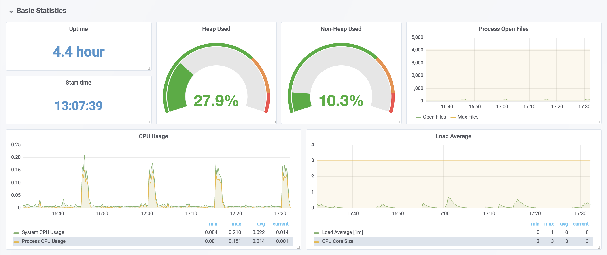
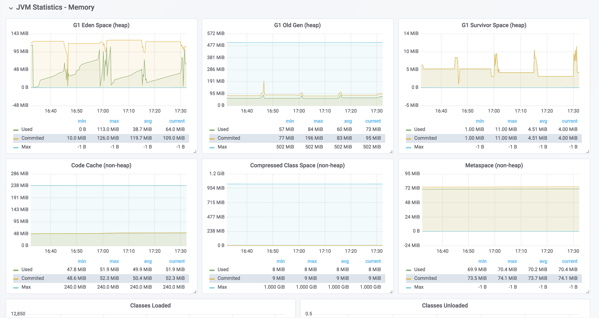
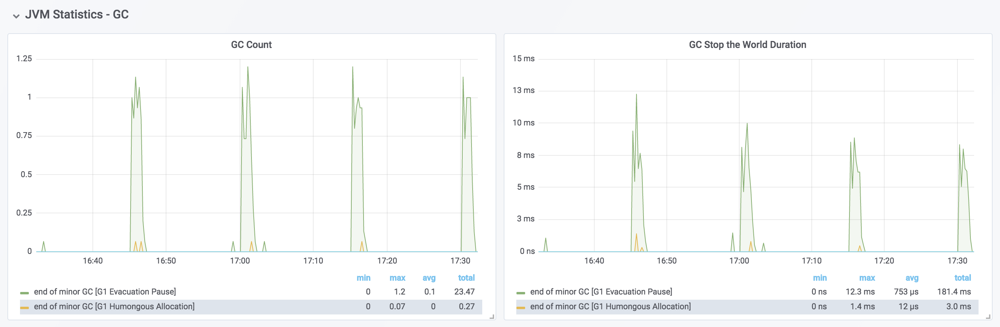
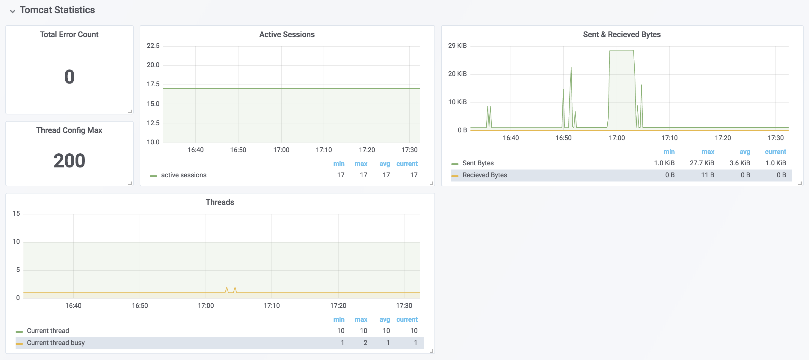

# spring-boot-performance-analysis

You will learn how to analyze and tune spring boot application performance.
We analyze database connection pooling (_HikariCP_) performance as an example, but
same techniques can be used to analyze other functional areas within the spring boot application.

### Tools

* **Micrometer** to _expose_ the metrics from the spring boot application
* **Prometheus** to _store_ and _time-series aggregation_ of metric data
* **Grafana** to _visualize_ the aggregated metric data from Prometheus
* **Docker** to _run_ Prometheus and Grafana in containers.
* **JMeter** for _load tests_


### Setup

1. Configure `Actuator` and `Prometheus Registry` in **your** Spring Boot 2.x app

    `build.gradle`
    ```
    dependencies {
        ...    
        implementation 'org.springframework.boot:spring-boot-starter-web'
        implementation 'org.springframework.boot:spring-boot-starter-actuator'
        implementation 'io.micrometer:micrometer-registry-prometheus'
        ...
    }
    ```

2. GIT clone from https://github.com/pbelathur/spring-boot-performance-analysis.git

3. `cd spring-boot-performance-analysis`

4. `cd docker`

5. Replace `LOCAL_MACHINE_IP` with the **actual** IP address of the machine running Docker in `prometheus.xml`

    ```
    scrape_configs:
    - job_name: 'performance-troubleshooter'
      scrape_interval: 5s
      metrics_path: '/actuator/prometheus'
      static_configs:
        - targets: ['LOCAL_MACHINE_IP:PORT']
    ```
    * LOCAL_MACHINE_IP is **NOT** `localhost` OR `127.0.0.1`
    * PORT is the Spring Boot application port usually 8080


6. Start `Prometheus` and `Grafana` using `docker-compose up`

7. Verify `prometheus` can communicate with your spring boot application
    - using a web browser access `http://localhost:9090/targets`


8. Verify `grafana` can communicate with `prometheus`

     - using a web browser access `http://localhost:3000`
     - under the `Recently viewed dashboards` look for the entry `Spring Boot 2.1 Statistics`
     - click on `Spring Boot 2.1 Statistics` and look for `Instance =` `LOCAL_MACHINE_IP:PORT` specified in `prometheus.xml`


9. Setup `JMeter` load test with REST API endpoint on your spring boot app with `number-of-threads=240`, `ramp-up-period=30s` and `loop-count=25`

  - Refer to https://octoperf.com/blog/2018/04/23/jmeter-rest-api-testing/ for JMeter setup for REST endpoint load tests.

### Execution

1. Start your Spring Boot application (_system under test_)

2. Start JMeter load test on your laptop

3. View Grafana `Spring Boot 2.1 Statistics` dashboard at http://localhost:3000 **during** the execution of the JMeter load test.

    NOTE: _screenshots shown here are for illustration purposes only_
    
    
    
    

4. Analyze the **HikariCP Statistics** in **Grafana** dashboard.
   

      - **Connection Size** is the total connections in DB connection pool (`active + idle + pending`).
      - **Connections** is the count of `active`+ `idle` + `pending` connections over a rolling time window.
      - **Connection Usage Time** is approximately equal to `db query execution time`.
      - **Connection Acquire Time**
      - **Connection Creation Time**  

### Observations
  | Situation | active | idle | pending | Notes |
  | :--- | :--- | :--- |:--- | :--- |
  | _noisy neighbor_  | 0 | `> maximumPoolSize / 2` and `> minimumIdle` | 0 | if this condition is observed under _no-request scenario_ and after considerable time after the last request, then the spring boot app is a potential _noisy neighbor_, as idle connections are **not** returned to the pool and, they consume system resources on the database server which increase connection times, decrease throughput for other applications using the same database server.|
  | _sweetspot_ | `maximumPoolSize` | `<=minimumIdle` | `< 2 x maximumPoolSize` | best possible in terms of database performance, utilization and minimize chance for app to be a noisy neighbor.|
  | _inadequate connections_ | `maximumPoolSize` | `<= minimumIdle` | `>3 x maximumPoolSize` | if _consistent_ spike is noticed in `Connection Usage Time`, then increase connection pool size in steps of 2 until you see performance improvement.

- If **Connections** < `active + idle + pending`
there is a _potential memory leak_ which needs further investigation through _thread/memory dump analysis_ using JDK VisualVM.

# Best Practices
A spring boot application with a service taking 50ms to complete a database query using a single connection is used to provide insights in calculating the connection pool size, idle pool size and timeouts.

#### Connection Pool Size
  * `spring.datasource.hikari.maximum-pool-size`
  * `50ms/database query` => `200 database queries/sec` per connection
  * If `pool size = 10 connections` on a single app instance, then we can handle `200 X 10 = 2000 queries/sec` per instance.
  * if we scale the apps instance to 20, we can handle `2000 x 20 = 40,000 queries/sec` among 20 instances, by using `10 x 20 = 200 connections`  

    **Recommendation**  
    Keep `pool size <= 10 connections` per app instance and _sensible_ app instance scaling to keep the `total db connections < 1000` across all app instances (_especially for Oracle_) will result in minimizing the _noisy neighbour effects_ in PCF.

#### Idle Timeout
  * `spring.datasource.hikari.idle-timeout`
  * if the database queries are fast < 250ms, then idle timeout to 10s, so that the connections are reclaimed faster preventing too many idle connections in pool.
  * for long running database queries set this value just slightly higher than the average query time.

#### Maximum lifetime
  * `spring.datasource.hikari.max-lifetime`
  * this should be set several seconds shorter than any database or infrastructure imposed connection time limit. The main idea here is the application needs to timeout _before_ the infrastructure imposed connection time limit.

#### Connection Timeout
  * `spring.datasource.hikari.connection-timeout`
  * the 30s default might be high for time critical apps, hence set the value based on the `time criticality` of the app. With 5s-10s for time critical applications. Making this value too small will result in SQLExceptions flooding the logs.
