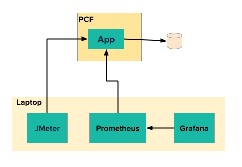
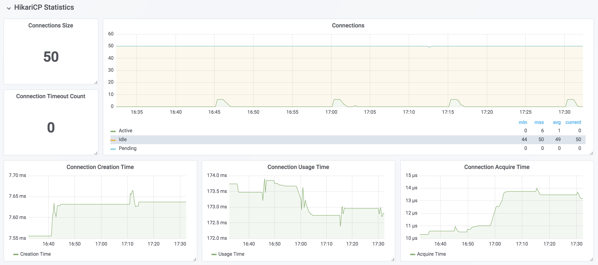

# Less is more for the database connection pools in the cloud

**Prashanth `PB` Belathur**  
**Staff Solutions Architect, VMWare Pivotal**

## TL;DR
 A well behaved spring boot app in a single-tenant host, when deployed in a multi-tenant host (_cloud_) degrades performance of other applications in the neighborhood. Be wary of the Hikari Connection Pool configuration in your spring boot app which in most cases are _oversized_ and, a few of the properties are set to the _upper limit_ by default.  The properties need to be _downsized_ for deployment in a multi-tenant cloud environment to minimize the _noisy neighbor_ impacts.

## Recommendations

   Applicable for any spring boot application using HikariCP and deployed in the cloud (PCF, AWS, Azure etc.)

  * keep pool size under 10 connections per application instance.

  * always specify the idle timeout, the default 10s is usually high for quick response apps.

  * a sensible application instance scaling to keep the total database connections under 1000 across all the application instances to minimize the _noisy neighbour_ impacts.

  * research your infrastructure imposed connection time limits and, then set the maximum lifetime and connection timeout appropriately.


## Overview

A critical spring boot application for a major shipping company uses Oracle as the datastore. The database server also hosts databases for other unrelated applications. The critical application would behave and perform well when running in a VM, but when deployed in Pivotal Cloud Foundry (PCF), all the other applications in the same PCF org/space encountered severe performance degradation.

I outline the technique used to identify/analyze the cause for performance degradation and, fine-tune the spring boot application to minimize the _noisy neighbor_ impact on other applications.

### Tools

* **Micrometer** to _expose_ the metrics from the spring boot application
* **Prometheus** to _store_ and _time-series aggregation_ of metric data
* **Grafana** to _visualize_ the aggregated metric data from Prometheus
* **Docker** to _run_ Prometheus and Grafana in containers.
* **JMeter** for _load tests_



### Setup

1. Configure `Actuator` and `Prometheus Registry` in **your** Spring Boot 2.x app

    `build.gradle`
    ```
    dependencies {
        ...    
        implementation 'org.springframework.boot:spring-boot-starter-web'
        implementation 'org.springframework.boot:spring-boot-starter-actuator'
        implementation 'io.micrometer:micrometer-registry-prometheus'
        ...
    }
    ```

2. GIT clone this repo [https://github.com/pbelathur/spring-boot-performance-analysis.git]

3. Replace `LOCAL_MACHINE_IP` with the **actual** IP address of the machine running Docker in `spring-boot-performance-analysis/docker/prometheus.yml`

    ```
    scrape_configs:
    - job_name: 'performance-troubleshooter'
      scrape_interval: 5s
      metrics_path: '/actuator/prometheus'
      static_configs:
        - targets: ['LOCAL_MACHINE_IP:PORT']
    ```
    * LOCAL_MACHINE_IP is **NOT** `localhost` OR `127.0.0.1` as the **prometheus** and **grafana** is running as docker container.
    * PORT is the Spring Boot application port usually 8080


4. Start **Prometheus** and **Grafana** on your computer: `docker-compose up`

5. Verify **Prometheus** can communicate with your spring boot application
    - using a web browser access `http://localhost:9090/targets`


6. Verify **Grafana** can communicate with **Prometheus**

     - using a web browser access `http://localhost:3000`
     - under the `Recently viewed dashboards` look for the entry `Spring Boot 2.1 Statistics`
     - click on `Spring Boot 2.1 Statistics` and look for `Instance =` `LOCAL_MACHINE_IP:PORT` specified in `prometheus.yml`


7. Setup **JMeter** load test with REST API endpoint on your spring boot app with `number-of-threads=240`, `ramp-up-period=30s` and `loop-count=25`

    - Refer to https://octoperf.com/blog/2018/04/23/jmeter-rest-api-testing/ for JMeter setup for REST endpoint load tests.

### Execution

1. Start your Spring Boot application

2. Start JMeter load test on your computer

3. During the execution of the load test, access http://localhost:3000 --> **HikariCP Statistics** section in __Spring Boot 2.1 Statistics__ dashboard

   

      - **Connection Size** is the total connections in DB connection pool (`active + idle + pending`).
      - **Connections** is the count of `active`+ `idle` + `pending` connections over a rolling time window.
      - **Connection Usage Time** is approximately equal to `db query execution time`.
      - **Connection Acquire Time**
      - **Connection Creation Time**

  ### Observations

  | Situation | active | idle | pending | Notes |
  | :--- | :--- | :--- |:--- | :--- |
  | _noisy neighbor_  | 0 | `> maximumPoolSize / 2` and `> minimumIdle` | 0 | if this condition is observed under _no-request scenario_ and after considerable time since the last request, then the spring boot app is a potential _noisy neighbor_, as idle connections are **not** returned to the pool and, they consume system resources on the database server which increase connection times, decrease throughput for other applications using the same database server.|
  | _sweet spot_ | `maximumPoolSize` | `<=minimumIdle` | `< 2 x maximumPoolSize` | best possible in terms of database performance, utilization and minimize chance for app to be a noisy neighbor.|
  | _inadequate connections_ | `maximumPoolSize` | `<= minimumIdle` | `>3 x maximumPoolSize` | if _consistent_ spike is noticed in `Connection Usage Time`, then increase connection pool size in steps of 2 until you see performance improvement.

  - If **Connections** < `active + idle + pending`

    there is a _potential memory leak_ in the spring boot application that needs further investigation using _memory/thread dump analysis_.

## Analysis
A spring boot application with a service taking 50ms to complete a database query using a single connection is used to provide insights in calculating the connection pool size, idle pool size and timeouts.

#### Connection Pool Size
  * `spring.datasource.hikari.maximum-pool-size`
  * `50ms/database query` => `200 database queries/sec` per connection
  * If `pool size = 10 connections` on a single app instance, then we can handle `200 X 10 = 2000 queries/sec` per instance.
  * if we scale the apps instance to 20, we can handle `2000 x 20 = 40,000 queries/sec` among 20 instances, by using `10 x 20 = 200 connections`  

    Keeping `pool size <= 10 connections` per app instance and _sensible_ app instance scaling to keep the `total db connections < 1000` across all app instances (_especially for Oracle_) results in minimizing the _noisy neighbour_ impacts in PCF.

#### Idle Timeout
  * `spring.datasource.hikari.idle-timeout`

  * the 10s default is high for most applications; set this value slightly higher than the average database query time. so that the connections are reclaimed faster preventing too many idle connections in pool.
  (e.g. `average database query time = 50ms`, `idle-timeout = 100ms`)

#### Maximum lifetime
  * `spring.datasource.hikari.max-lifetime`

  * this should be set several seconds shorter than any database or infrastructure imposed connection time limit. The main idea here is the application needs to timeout _before_ the infrastructure imposed connection time limit.

#### Connection Timeout
  * `spring.datasource.hikari.connection-timeout`

  * the 30s default might be high for time critical apps, hence set the value based on the `time criticality` of the app. With 5s-10s for time critical applications. Making this value too small will result in SQLExceptions flooding the logs.

## Sample HikariCP Configuration

  ```
  # maximum db connections in pool
  spring.datasource.hikari.maximum-pool-size=10

  # minimum number of idle connections maintained by HikariCP in a connection pool
  spring.datasource.hikari.minimum-idle=3

  # maximum idle time for connection
  spring.datasource.hikari.idle-timeout=100  # 100ms

  # maximum number of milliseconds that a client will wait for a connection from pool
  spring.datasource.hikari.connection-timeout=10000 # 10s

  # maximum lifetime in milliseconds of a connection in the pool after it is closed.
  spring.datasource.hikari.max-lifetime=120000 # 2m
  ```
